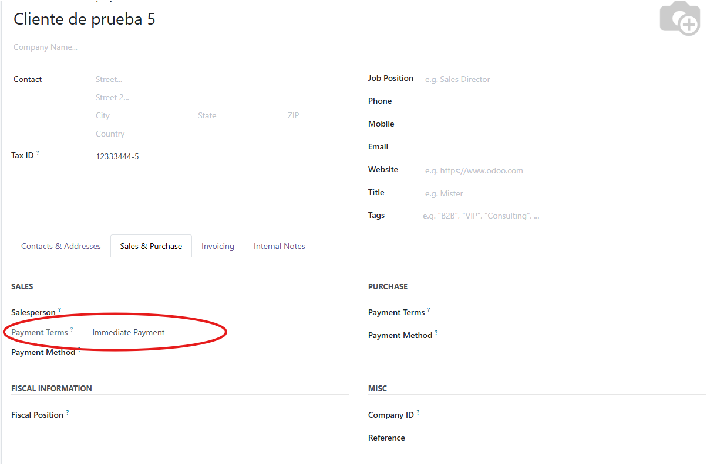
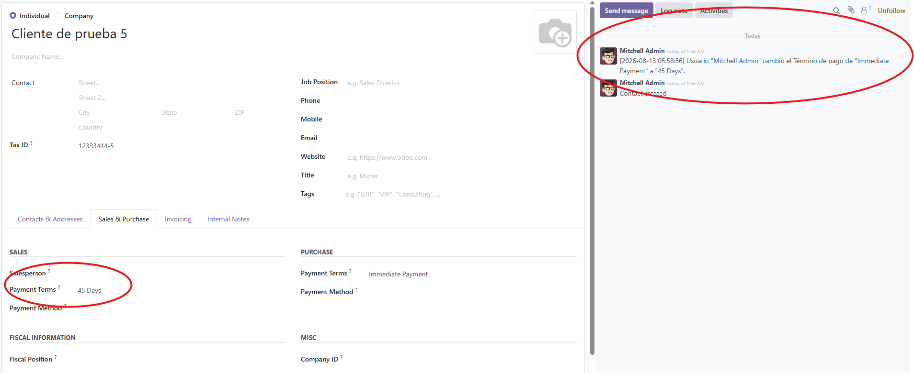
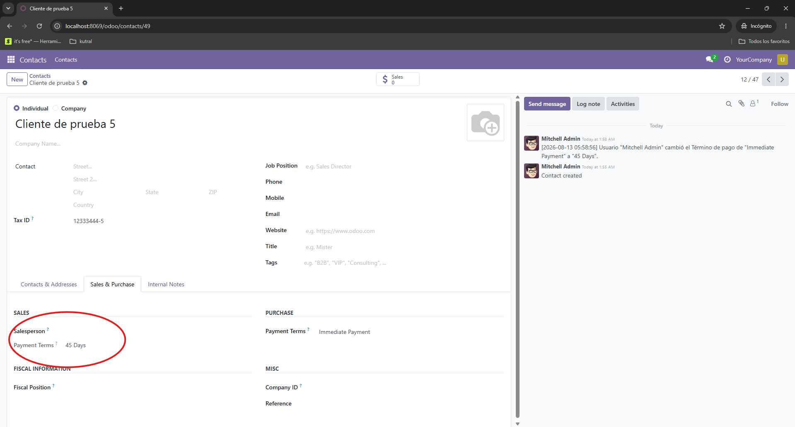

# Control Término de Pago en Clientes

## Objetivo
Asegurar que todos los nuevos clientes comiencen con el término de pago "Pago Inmediato", y restringir la modificación de este campo únicamente a los usuarios con rol de "Administrador de Contabilidad". Además, mantener un registro de auditoría en el Chatter.

## Pasos para instalar
1. Subir la carpeta `partner_pay_term` al directorio de addons de Odoo v18.
2. Reiniciar el servicio de Odoo.
3. Activar el modo desarrollador.
4. Ir a Aplicaciones y hacer clic en "Actualizar lista de aplicaciones".
5. Buscar e instalar el módulo "Control Término de Pago en Clientes".

## Cómo usarlo
Una vez instalado, el módulo opera de forma automática:
- **Nuevos Clientes:** Al crear un cliente, el término de pago será "Pago inmediato" por defecto.
- **Seguridad UI:** Si un usuario no es Administrador de Contabilidad, verá el campo "Término de pago" bloqueado (solo lectura).
- **Auditoría:** Cada vez que un Administrador cambie el valor, se generará un mensaje automático en el historial del cliente (Chatter) detallando el cambio.

## Capturas de pantalla
**1. Creación de cliente con "Pago inmediato":**

**2. Registro en Chatter de los cambios:**

**3. Campo bloqueado para usuarios sin permisos:**

