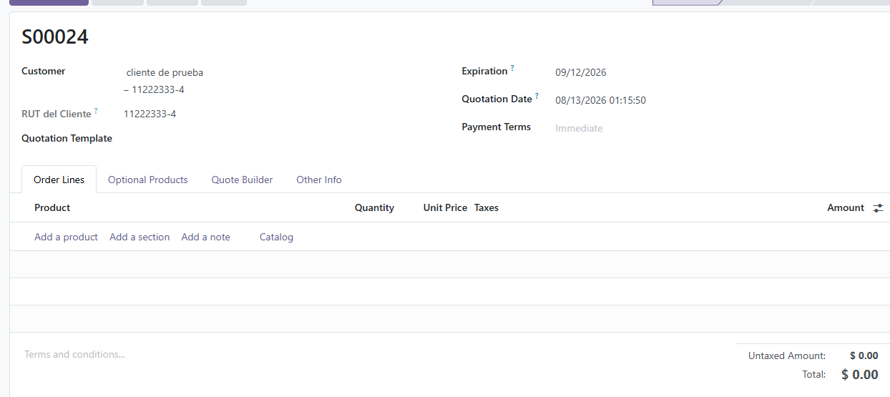
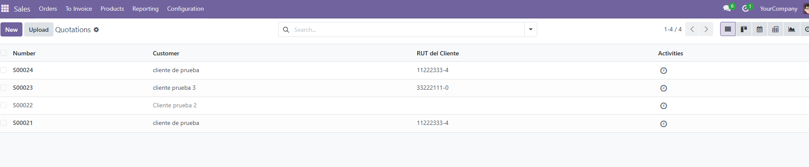
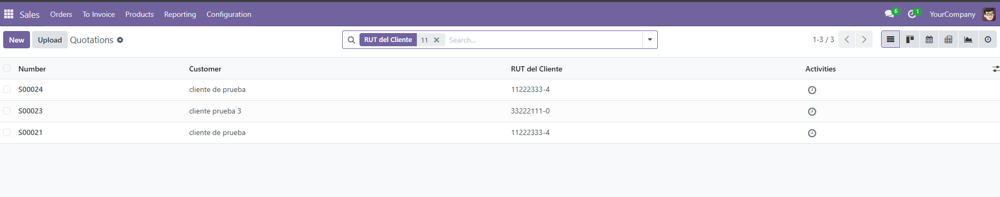

# RUT del Cliente en Ventas

## Objetivo
Mostrar de forma rápida y automática el RUT del cliente directamente en los pedidos de venta, ahorrando tiempo al evitar tener que abrir la ficha del contacto para consultarlo.

## Pasos para instalar
1. Subir la carpeta `sale_customer_rut_display` al directorio de addons de Odoo v18.
2. Reiniciar el servicio de Odoo.
3. Activar el modo desarrollador.
4. Ir a Aplicaciones y hacer clic en "Actualizar lista de aplicaciones".
5. Buscar e instalar el módulo "Visualización del RUT del cliente en Ventas".

## Cómo usarlo
El módulo se integra de forma transparente a la aplicación de Ventas:
- **En el formulario del pedido:** Al seleccionar a un cliente, su RUT aparecerá inmediatamente justo debajo.
- **En la lista de pedidos:** Verás una nueva columna con el RUT. Puedes hacer clic en el título de la columna para ordenar, o usar la barra de búsqueda superior para filtrar los pedidos por RUT.

## Capturas de pantalla
**1. Vista Formulario (RUT del Cliente llenado automáticamente):**

**2. Vista Lista (Columna con el RUT del Cliente):**

**3. Filtro de Búsqueda (Búsqueda rápida por RUT):**

